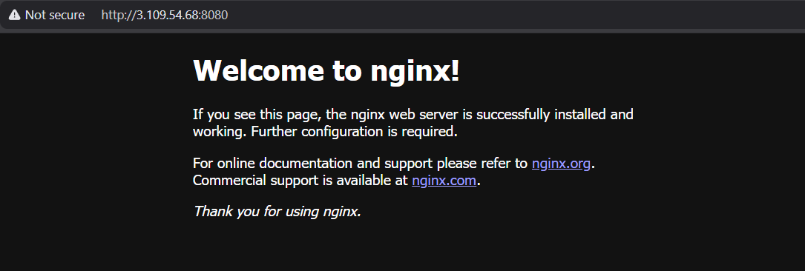

# Terraform Docker Nginx Project

## 📌 Overview

This project provisions an **Nginx web server** inside a Docker container using **Terraform**.  
It demonstrates how Terraform can manage containerized workloads using the [Docker Provider](https://registry.terraform.io/providers/kreuzwerker/docker).

---

## 🚀 Features

- Pulls the latest Nginx Docker image
- Runs Nginx container with port mapping
- Uses variables for flexibility (container name, port, image)
- Outputs the URL to access the server

---

## 🛠️ Prerequisites

- [Terraform](https://developer.hashicorp.com/terraform/downloads) >= 1.12
- [Docker](https://docs.docker.com/get-docker/) installed and running

---

## 📂 Project Structure

This Terraform project is organized to separate concerns and improve readability:

```
terraform-docker-nginx/
├── provider.tf     # Docker provider configuration
├── variables.tf    # Input variables for the project
├── main.tf         # Docker resources (image & container)
├── outputs.tf      # Terraform outputs (URLs, etc.)
└── README.md       # Project documentation
```

**Explanation:**
- `provider.tf` → Configures Terraform to use the Docker provider.
- `variables.tf` → Declares input variables like container name and ports.
- `main.tf` → Defines Docker resources (image and container).
- `outputs.tf` → Displays URLs or other useful outputs after `terraform apply`.
- `README.md` → Documentation and usage instructions.

---

## ▶️ Quick Start

1. **Clone the repository**

   ```bash
   git clone https://github.com/wayneisbatman/terraform-docker-nginx.git
   cd terraform-docker-nginx

   ```

2. **Initialize Terraform**
   ```bash
   terraform init

   ```

3. **Plan the deployment**
   ```bash
   terraform plan

   ```

4. **Apply the configuration**
   ```bash
   terraform apply -auto-approve

   ```

5. **Access Nginx**

   **a) Local access (inside the EC2 instance)**

   ```bash
   http://localhost:8080

   ```

   **b) External access (from your laptop/browser)**

   ```bash
   http://<ec2-public-ip>:8080

   ```
   
6. **Destroy resources**
   ```bash
   terraform destroy -auto-approve

   ```

---

### 🖼️ Nginx Output in Browser

Here’s how Nginx looks when accessed externally via the EC2 public IP:


